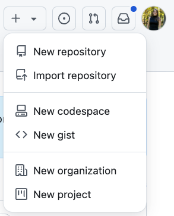
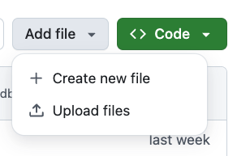

# Setting Up GitHub and Creating a Repository

## Step 1: Set Up a GitHub Account

1. Go to [GitHub](https://github.com/).
2. Click **Sign up** in the top-right corner.
3. Follow the prompts to create your account, including:
   - Choosing a username.
   - Entering your email.
   - Creating a password.
4. Verify your email address to activate your account.

## Step 2: Create a New Repository

1. After logging in, click the **+** icon in the top-right corner and select **New repository**.



2. Fill in the details:
   - **Repository Name**: Choose a name for your repository (e.g., `my-first-repo`).
   - **Description** (optional): Add a description of your project.
   - Choose **Public** for our purposes.
   - **Initialize this repository with a README**: Check this box.
3. Click **Create repository**.

## Step 3: Edit the `README.md` File

1. Once your repository is created, you'll be taken to the repository's main page.
2. Find the `README.md` file listed in the file list, and click on it.
3. Click the pencil icon (top-right of the file) to edit the file.
4. Add content to your `README.md` file. For example:
   ```markdown
   # My First Repository

   This is my first repository on GitHub!
5. Scroll down to the **Commit changes...** section:
- You can add a commit message to describe your changes.
- Choose **Commit changes** to save the updated file.

## Step 4: Add a New File to Your Repository

1. Go to your repository’s main page.
2. Click the **Add file** button near the top-right corner and select **Create new file**.



3. Enter a name for your file (e.g., `example.txt`).
4. In the text editor below, add content to the file. For example:
    ```markdown
   This is a new file added to my repository.

5. Select **Commit changes...** button on the top right:
- Enter a commit message to describe your changes (e.g., "Added example.txt").
- Leave the defualt **Commit directly to the main branch** if you want to add the file immediately.
6. Click **Commit changes** to save the file to your repository.

### Alternatively: Upload an Existing File
1. Click the **Add file** button and select **Upload files**.
2. Drag and drop the file(s) from your computer into the window, or click **choose your files** to browse for the file(s).
3. Add a commit message.
4. Click **Commit changes** to upload the file to your repository.

## Done!

You've successfully added a new file to your GitHub repository.

### For Self-Paced Users
Return to [Homepage](../index.md).