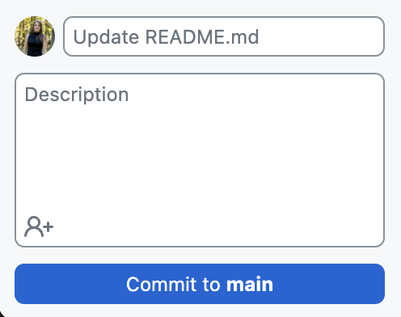

# Setting Up GitHub Desktop and Cloning a Repository

## Step 1: Download and Install GitHub Desktop

1. Go to the [GitHub Desktop website](https://desktop.github.com/).
2. Click the **Download for macOS** (or **Windows**, depending on your system) button.
3. Once the download is complete, open the installer and follow the on-screen instructions to install GitHub Desktop.

## Step 2: Set Up GitHub Desktop

1. Open **GitHub Desktop** after installation.
2. When prompted, **sign in to GitHub** using your GitHub username and password.

## Step 3: Clone Your Repository to Your Computer

1. Open **GitHub Desktop**.
2. In the top-left corner, click **File** > **Clone Repository**.
3. A window will appear with options to **clone from GitHub**. Make sure you’re signed in, and your repositories will appear.


4. Select the repository you want to clone (e.g., `my-first-repo`).
5. Choose the location on your computer where you want to clone the repository by clicking the **Choose...** button. The defualt will give you a new folder **GitHub** where you can keep all your cloned repositries if you want.
6. Click **Clone**.

## Step 4: Verify the Cloned Repository

1. After the cloning process is complete, GitHub Desktop will open the repository locally.


2. Open the folder on your computer where you cloned the repository, and you should see all the files from your GitHub repository. Alternatively, you can open the local copy of your repository from GitHub Desktop by clicking on **Show in Finder** (for Mac for Wondows it will say your defualt file system).


## Step 5: Edit a File Locally

1. Navigate to the folder on your computer where your repository is cloned.
2. Open one of the files in a text editor (e.g., `README.md`).
3. Make some changes to the file. For example, add a new line at the end of `README.md`:
   ```markdown
   This is my first edit to the README.md file.
4. **Save** the changes.


## Step 6: Commit and Push Changes to GitHub

1. Open **GitHub Desktop**. You should see a notification about the changes you've made.


2. In the left panel, you’ll see the file(s) you modified listed under **Changes**.
3. At the bottom of the left panel, type a brief commit message describing the change (e.g., “Updated README.md”).
4. Click the **Commit to main** button.



5. After committing, click the **Push origin** button at the top of GitHub Desktop to push your changes to GitHub.com.


6. After the push is complete, go to your GitHub repository on [GitHub.com](https://github.com) and refresh the page. You should see the changes reflected in the repository. Alternatively, you can click **View on GitHub** on your GitHub Desktop. 


## Done!

You have successfully downloaded and set up GitHub Desktop, and cloned your GitHub repository to your personal computer. Now you can start working on your repository locally and sync changes with GitHub.

### For Self-Paced Users
Return to [Homepage](../index.md).