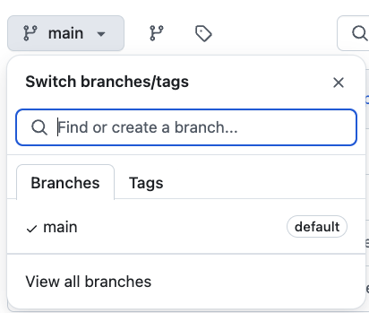
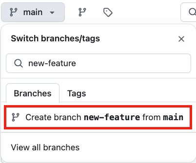
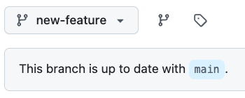
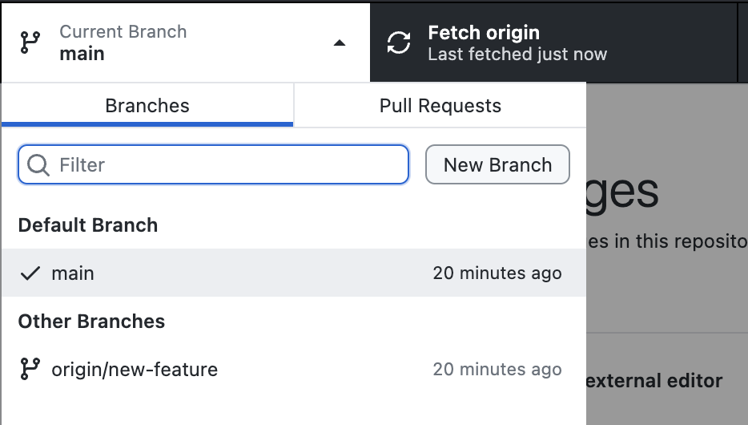
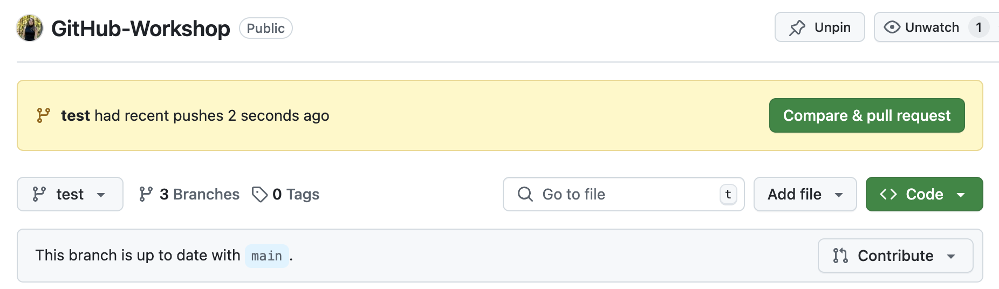
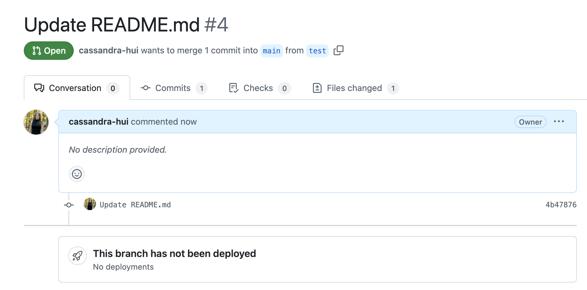
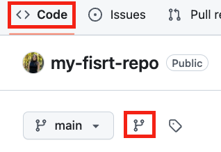
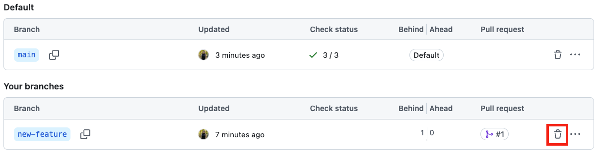
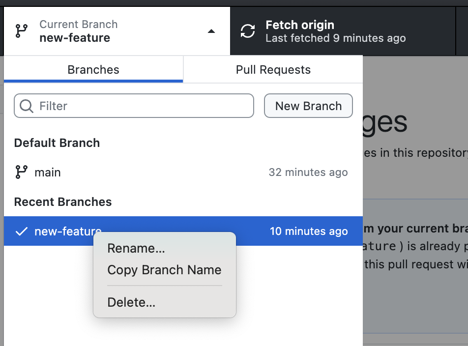

# Working with Branches in GitHub and GitHub Desktop

This guide will walk you through creating a branch on GitHub.com, cloning it to your computer using GitHub Desktop, and making changes locally.

---

## Step 1: Create a Branch on GitHub.com

1. Go to your repository on [GitHub.com](https://github.com).
2. Click the **Branch** dropdown menu near the top left (next to the default branch, usually `main`).

3. Type a name for your new branch (e.g., `new-feature`).
4. Click **Create branch new-feature from main** to create the branch.

5. Make sure your new branch is selected (you’ll see it displayed next to the branch dropdown).

---

## Step 2: Clone the Repository in GitHub Desktop

1. Open **GitHub Desktop**.
2. If the repository is **not** already cloned, click **File > Clone Repository** and select your repository from the list.
3. If it’s already cloned, make sure it’s selected from the repository dropdown at the top.

---

## Step 3: Switch to the New Branch in GitHub Desktop

1. In GitHub Desktop, click the **Current Branch** button in the top middle of the window.
2. Select the new branch you created (e.g., `new-feature`) from the list.
   - If the branch is not listed, click **Fetch Origin** to sync your local repository with GitHub.

3. You are now working on the new branch.

---

## Step 4: Make Changes Locally

1. Open the repository folder on your computer.
2. Make changes to any file (e.g., edit `README.md` or create a new file).
3. Save your changes.

---

## Step 5: Commit Changes to the Branch

1. Go back to **GitHub Desktop**. You should see your changes listed under **Changes**.
2. Add a commit message describing your changes (e.g., "Updated README.md with feature details").
3. Click **Commit to new-feature** to save your changes to the branch.

---

## Step 6: Push the Changes to GitHub.com

1. After committing, click the **Push Origin** button at the top in GitHub Desktop.
2. This will upload your changes to the `new-feature` branch on GitHub.com.

---

## Step 7: Verify Changes on GitHub.com

1. Go to your repository on GitHub.com.
2. Switch to the `new-feature` branch using the branch dropdown.
3. Verify that the changes you made locally are reflected in the branch on GitHub.com.

---

## Step 8: Merge the Branch into the Main Branch

You should see a new `Compare & pull request` button. You can click that and move on to step 4. Or start from the begining.

1. On GitHub.com, go to the **Pull requests** tab in your repository.
2. Click **New pull request**.
3. Select the `main` branch as the base and the `new-feature` branch as the compare branch.
4. Review the changes at the bottom of the page, then click **Create pull request**.

5. This should bring you to a comparison of the branches:

Click on `Files changed` to view the differences between branches.
5. Go back to `Conversation` and click **Merge pull request**.
6. Confirm the merge when prompted.

---

## Step 9: Delete the Branch

1. After merging the branch, you can delete it on GitHub.com:
   - On the code page, click the **Branch** button.

   - All of your branches will be listed. Click on 🗑️ to delete the branch. 

2. Alternatively, delete the branch in **GitHub Desktop**:
   - Click the **Current Branch** button.
   - Right-click the `new-feature` branch and select **Delete**.

---

## Done!

You’ve successfully created a branch on GitHub, worked on it locally using GitHub Desktop, and pushed your changes back to GitHub.

### For Self-Paced Users
Return to [Homepage](../index.md).