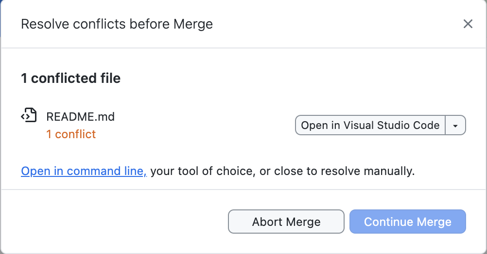

# Collaborating on a GitHub Repository Using GitHub Desktop

## Step 1: Add a Collaborator to Your Repository

1. Go to your repository on [GitHub.com](https://github.com).
2. Click the **Settings** tab at the top of the repository page.


3. In the left-hand menu, select **Collaborators** under the "Access" section.


4. Enter your password.
5. Click the **Add people** button.


6. Enter your collaborator's GitHub username or email, and select them when they appear.
7. Click **Add** to invite the collaborator.
8. Your collaborator will receive an email or notification to accept the invitation.

## Step 2: The Collaborator Accepts the Invite and Clones the Repository

1. Once you (the collaborator) receives the email, click **View Invitation**. 
2. Click **Accept invitation**.


3. Clone the repository using from GitHub by clicking the green button **<> Code** and then **Open in GitHub Desktop**.


4. Confirm the location and click **Clone**.

## Step 3: The First Person Makes an Edit and Pushes It

1. Chose which student will be **1** and which will be **2**.
2. The **first student** should open one of the files (e.g., `README.md`) on your local machine and make a small edit. For example:
   ```markdown
   This is an edit made by Student 1.
   ```
3. Save the file.
4. In **GitHub Desktop**, write a commit message (e.g., "Updating README.md").
5. Click the **Commit to main** button.
6. Click the **Push origin** button to push the changes to GitHub.

## Step 4: The Second Person Pulls the Changes

1. The **second student** should open **GitHub Desktop** and go to the same repository.
2. Click the **Fetch origin** button at the top to check for updates.
3. If changes are found, click **Pull origin** to download and sync the changes made by the first student.
4. Verify that the changes (e.g., the edit made by the first student in `README.md`) have appeared in your local copy of the repository.

## Step 5: Create a Conflict

1. Both students should now open the `README.md` file **at the same time**.
2. Each student makes a different change **without pulling first**. For example:
   - **Student 1** adds:
     ```markdown
     This is a change by Student 1.
     ```
   - **Student 2** adds:
     ```markdown
     This is a change by Student 2.
     ```
3. Both students save their changes.

4. **Student 1** commits and pushes their change:
   - In **GitHub Desktop**, Student 1 writes a commit message (e.g., "Student 1's change") and clicks **Commit to main**.
   - Click the **Push origin** button to push the changes to GitHub.

5. **Student 2** then tries to push their change **without pulling first**:
   - In **GitHub Desktop**, Student 2 writes a commit message (e.g., "Student 2's change") and clicks **Commit to main**.
   - When Student 2 tries to push their changes, GitHub Desktop will notify them that their branch is out of date and needs to pull the latest changes first.

   


## Step 6: Resolve the Conflict

1. **Student 2** should now click **Fetch** in GitHub Desktop and then **Pull origin** to fetch the changes from the repository.
2. A conflict message will appear, showing that there is a merge conflict in the `README.md` file.



### Resolving the Conflict

1. Click **Open in Visual Studio Code** (or any other text editor) when prompted to resolve the conflict.
2. The conflicting lines in the `README.md` file will be marked. It will look something like this:
   ```plaintext
   <<<<<<< HEAD
   This is a change by Student 2.
   =======
   This is a change by Student 1.
   >>>>>>> origin/main
   ```
3. **Manually edit the file** to resolve the conflict. For example, the students can decide to keep both changes:
   ```markdown
   This is a change by Student 1.
   This is a change by Student 2.
   ```
4. Save the file after resolving the conflict.

### Finalizing the Merge

1. Go back to **GitHub Desktop**, and you'll see a prompt asking you to continue the merge.


2. Click the **Continue merge** button.
3. Click the **Push origin** button to push the merged changes to GitHub.
4. Confirm that GitHub.com is updated.
5. The **first student** should now update their local respository by clicking **Fetch origin** and then **Pull origin** in **GitHub Desktop** and check that the file is changed locally. 


## Done!

Both students have successfully collaborated on the repository, resolved a conflict, and synced their changes using GitHub Desktop and GitHub.com.


### For Self-Paced Users
Return to [Homepage](../index.md).