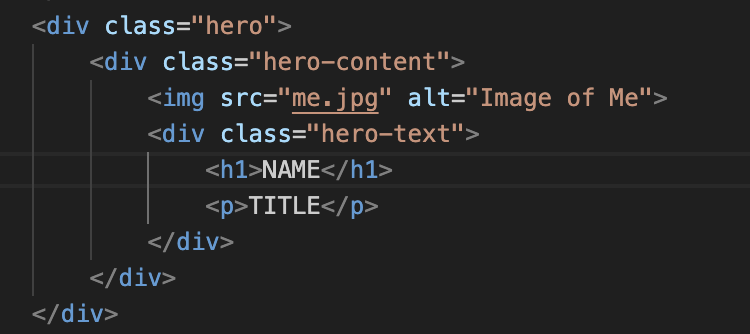
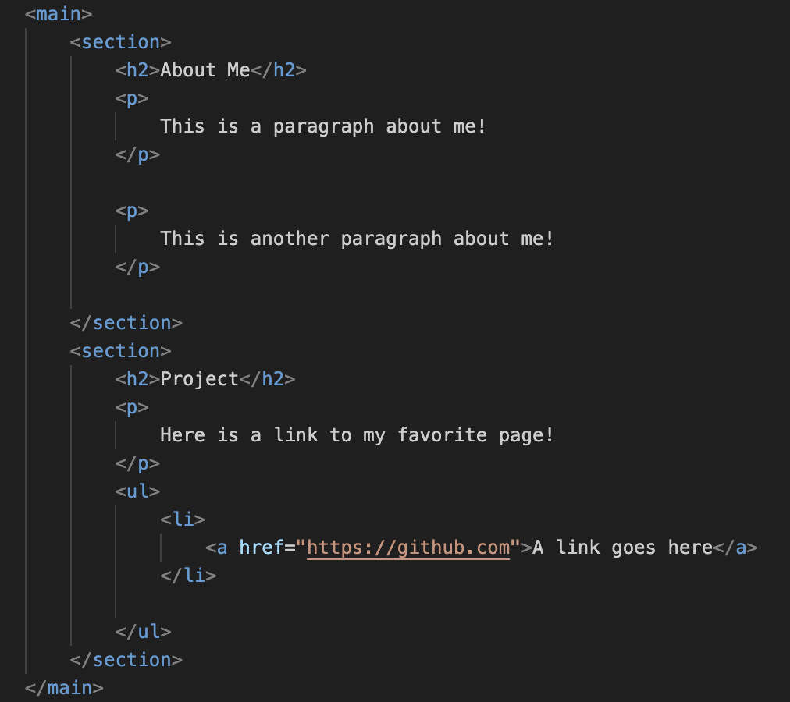

# Cloning and Creating a GitHub Pages Site

## Step 1: Cloning the Repository

1. Go to the following repository: [Cassandra's GitHub Workshop](https://github.com/cassandra-hui/GitHub-Workshop.git).
2. Click the **Code** button (green button) you can copy the repository URL under the HTTPS option and manually enter it or click on **Open with GitHub Desktop**.
3. Check the **Local Path** location is where you want the new file to be located.
4. Click **Clone**.

You now have a local copy of the workshop's repository. 

## Step 2: Create Your GitHub Pages Repository

1. Go to your GitHub profile and click the **+** button in the top-right corner, then select **New repository**.
2. Name the repository as **username.github.io**, replacing "username" with your GitHub username (e.g., `johnDoe.github.io`). You must use your GitHub profiles's username.
3. Set the repository to **Public** and click **Create repository**.
4. Clone this new repository to your local machine using **GitHub Desktop** the same way you did in Step 1.

## Step 3: Initialize the Respositry by Adding a README.md

1. Open the `README_Template.md` from Cassandra's clonded **GitHub Workshop** folder.
2. Copy the tempate and add the content to a `README.md` file in your **username.github.io** folder.
3. Make your first **Commit**.
4. Optional: Edit the `README.md` to fit your page. You can also do this later. Keep this template for future repositories you create.

## Step 4: Copy the Website Template

1. On your computer, open the cloned folder for the GitHub Pages repository (`username.github.io`).
2. In another window, open the folder for the cloned **GitHub Workshop** repository.
3. Navigate to the **Templates/Website Template** folder in the **GitHub Workshop** repository.
4. Copy all the files (e.g., `index.html`, `about.html`, `style.css`, `script.js`, images) from the **Website Template** folder.
5. Paste these files into the cloned folder for your GitHub Pages repository.
6. In this folder, open `index.html` with your defualt internet browser to see what the page currently looks like.

## Step 5: Edit the Website Template

Now you’ll edit the template to personalize your website.

1. Open the `index.html` file in a text editor.



2. Replace `NAME` and `TITLE` in the hero section with your own name and title. For example:
    ```html
    <h1>John Doe</h1>
    <p>Data Scientist</p>
    ```
3. Customize the **About Me** section with your own information in both `index.html` and `about.html`.
    ```html
    <p>This is a paragraph about me!</p>
    <p>This is another paragraph about me!</p>
    ```


4. Add links to any projects or content you'd like to showcase.

### Changing the Images

5. To change the profile picture or other images in your template:
   1. Replace the existing image file(s) in your repository (e.g., `me.jpg` or `unr.jpg`) with your own image files. Make sure the new images have the same file name as the originals, or update the file paths in `index.html` accordingly.
   2. If you want to change the profile picture, locate the following part of the `index.html` file (you can use **Find**):
       ```html
       
       ```
       Replace `"me.jpg"` with the name of your new image file (e.g., `"myphoto.jpg"`), and ensure the image is uploaded to the repository.
   3. Similarly, if you want to change the background image in the hero section, update this line in the CSS file (`style.css`):
       ```css
       .hero {
           background: url('unr.jpg') no-repeat center center/cover;
       }
       ```
       Replace `'unr.jpg'` with your desired image file (e.g., `'mybackground.jpg'`), and make sure the image is uploaded.

6. Save your changes to `index.html` and `style.css`.

## Step 7: Publish Your GitHub Pages Website

1. After editing the files, save your changes.
2. In **GitHub Desktop**, go to your **username.github.io** repository and you should see the modified files listed under **Changes**.
3. Add a commit message (e.g., "Personalized website with templates").
4. Click **Commit to main**.
5. Click **Push origin** to push your changes to GitHub.
6. Your website will be live at `https://username.github.io` within a few minutes.

## Done!

You've successfully created a GitHub Pages site and published your site online.


### For Self-Paced Users
Return to [Homepage](../index.md).